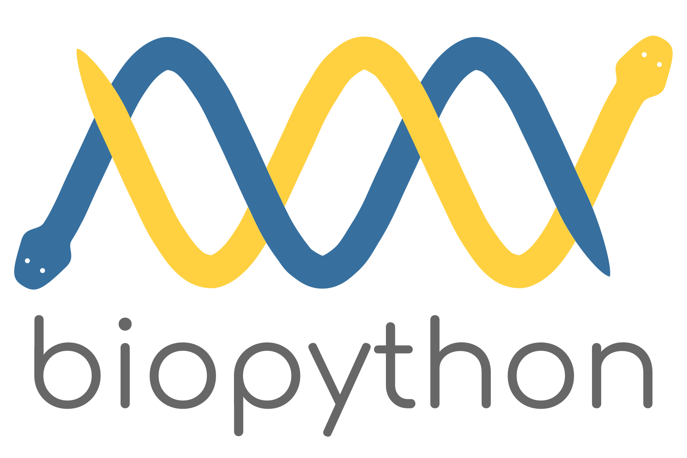

<!-- HEADER -->
<h1 align="center">
  
</h1>

<!-- QUOTE -->

  

<!-- ABOUT ME -->

  
  <code style="color:#00FF00;">whoami --about</code>

<pre>
  [1] M.Sc. in Quantitative & Computational Biology @ <a href="https://www.unitn.it" target="_blank">University of Trento (UniTn)</a>
  [2] B.Sc. in Bioinformatics @ <a href="https://www.lau.edu.lb" target="_blank">Lebanese American University (LAU)</a>
  [3] Mentored 400+ tech minds
  [4] <a href="https://instagram.com/fred_draws">Pencil artist</a> & chess player
  [5] Exploring the neural world, one synapse at a time
  [6] Researching to improve Anti-Microbial Resistance prediction using deep CNNs
  [7] Sipping tea & blasting music while firing my neurons
</pre>

<!-- INTERESTS -->

  
  <code style="color:#00FF00;">cat ~/interests.txt</code>

<pre>
  [1] Machine Learning & Artificial Intelligence
  [2] Precision Medicine
  [3] Computational Neuroscience
  [4] Computational Immunotherapy
  [5] Computational Microbial Genomics
  [6] Software Engineering
  [7] and more...
</pre>

<!-- CONTACT -->

  
  <code style="color:#00FF00;">ssh connect@frederick</code>

<pre>
  [1] Email        : frederickabichahine@gmail.com
  [2] University   : frederick.abichahine@studenti.unitn.it
  [3] LinkedIn     : <a href="https://linkedin.com/in/frederick-abi-chahine" target="_blank">linkedin.com/in/frederick-abi-chahine</a>
  [4] Instagram    : <a href="https://instagram.com/fred_abichahine" target="_blank">instagram.com/fred_abichahine</a>
  [5] Twitter      : <a href="https://twitter.com/fredabichahine" target="_blank">twitter.com/fredabichahine</a>
  [6] HackerRank   : <a href="https://www.hackerrank.com/freddyabichahine" target="_blank">hackerrank.com/freddyabichahine</a>
</pre>

<!-- TOOLKIT -->

  
  <code style="color:#00FF00;">tree ~/toolkit</code>

<pre>
toolkit
├── languages
├── frameworks_and_libraries
├── tools_and_platforms
└── operating_systems
</pre>

<!-- LANGUAGES -->

  
  <code style="color:#00FF00;">ls ~/toolkit/languages</code>

  
  
  
  
  
  
  
  
  
  
  

<!-- FRAMEWORKS & LIBRARIES -->

  
  <code style="color:#00FF00;">ls ~/toolkit/frameworks_and_libraries</code>

  
  
  
  
  
  
  
  
  
   
  
  
  
  

<!-- TOOLS & PLATFORMS -->

  
  <code style="color:#00FF00;">ls ~/toolkit/tools_and_platforms</code>

  
  
  
  
  
  
  
  
  
  
  
  
  
  
  
  
  

<!-- OPERATING SYSTEMS -->

  
  <code style="color:#00FF00;">ls ~/toolkit/operating_systems</code>

  
  

<!-- STATISTICS -->

  
  <code style="color:#00FF00;">~/show_stats.sh</code>

  
  

