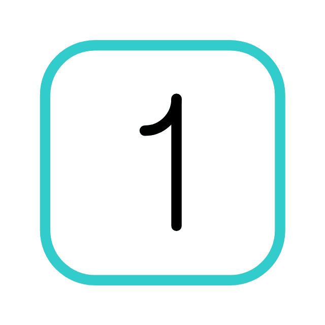
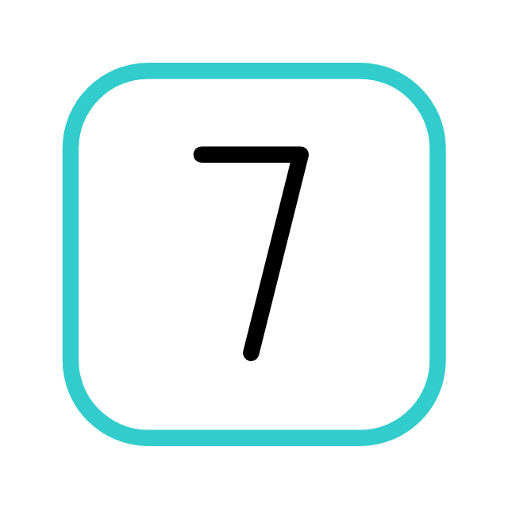
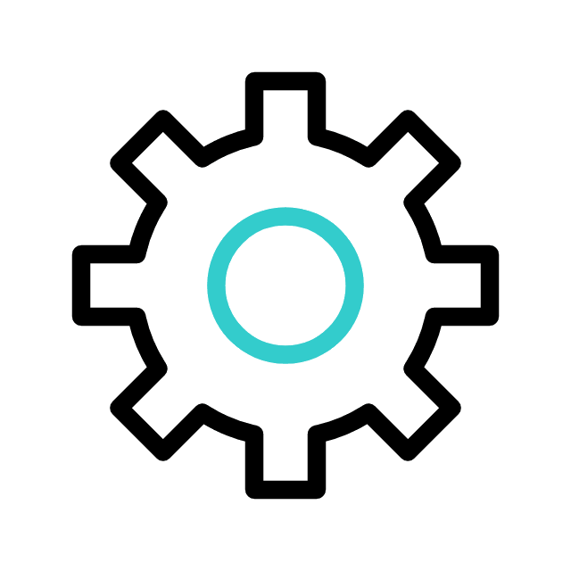

<h1 align="center">Hello World, I'm Frederick Abi Chahine </h1>
<h3 align="center">   Seeking & Spilling Knowledge  </h3>

###  About myself:

 Bioinformatics senior student at the <a href="https://www.lau.edu.lb/">Lebanese American University (LAU) </a>  
 <a href="https://instagram.com/fred_draws">Pencil artist </a> & chess player  
 Working at <a href="https://sefactory.io/">SE Factory </a> as an Algorithms & Data Structures Instructor  
 Working at LAU as an Object-Oriented Programming Instructor  
 Researching to improve Kidney Fibrosis Prediction at LAU  
 Delving deeper into Convolutional Neural Networks & Full Stack Web Development  
 Sipping tea & blasting music while firing my neurons

###  My interests:

 Machine Leaning / Deep Learning  
 Data Science / Network Science  
 Computational Neuroscience  
 Computational Immunology  
 Full-Stack Web Development  
 *and more...*

###  Reach out & connect with me to share & discuss inovative ideas:

**frederickabichahine@gmail.com** | **frederick.abichahine@lau.edu**

###  Languages & tools:

                     

###  Some statistics:

&nbsp;

&nbsp;

