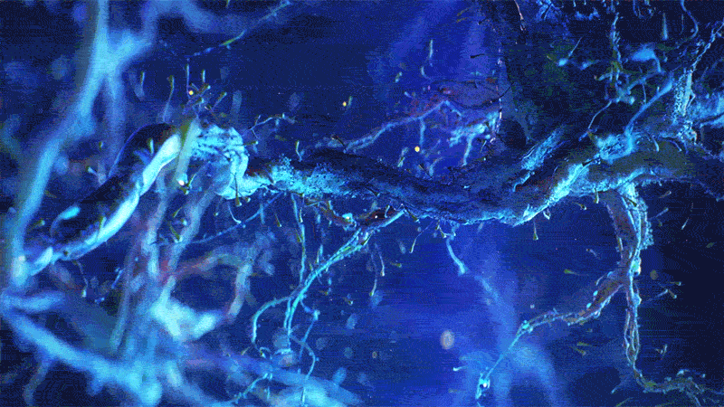

<h1 align="center">Hello World, I'm Frederick Abi Chahine </h1>
<h3 align="center">   Seeking & Spilling Knowledge  </h3>

  

###  About myself:

 M.Sc. in Quantitative & Computational Biology @ [University of Trento (UniTn)](https://www.unitn.it/en)  
 B.Sc. in Bioinformatics @ [Lebanese American University (LAU)](https://www.lau.edu.lb/)  
 [Pencil artist](https://instagram.com/fred_draws) & chess player  
 Exploring the neural world, one synapse at a time  
 Researching to improve Anti-Microbial Resistance prediction using deep CNNs  
 Sipping tea & blasting music while firing my neurons

###  My interests:

 Machine Learning & Artificial Intelligence  
 Precision Medicine  
 Computational Neuroscience  
 Computational Immunotherapy  
 Computational Microbial Genomics  
 Software Engineeing  
 *and more...*

###  Reach out & connect with me to share & discuss inovative ideas:

  
  
  
  

> **frederickabichahine@gmail.com** | **frederick.abichahine@studenti.unitn.it**

###  What I Use:

> Languages

  
  
  
  
  
  
  
  
  
  
  

> Tools & Frameworks

  
  
  
  
  
  
  
  
  
  
  
  
  
  
  
  
  
  
  
  
  
  

> Operating Systems

  
  
  
  

###  Some statistics:

    

        
    

    

        
    

